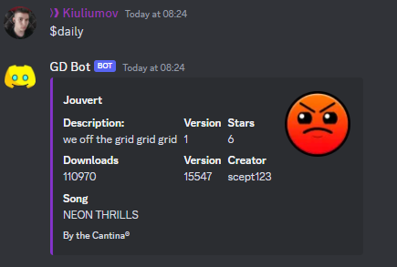
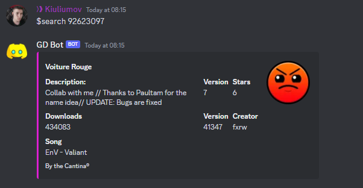
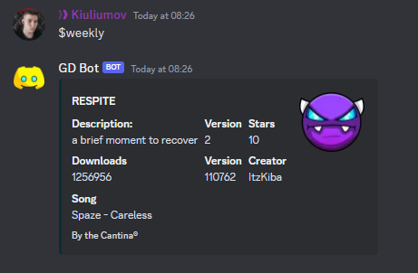
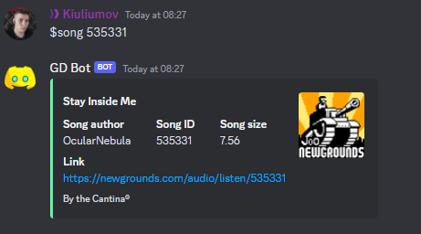
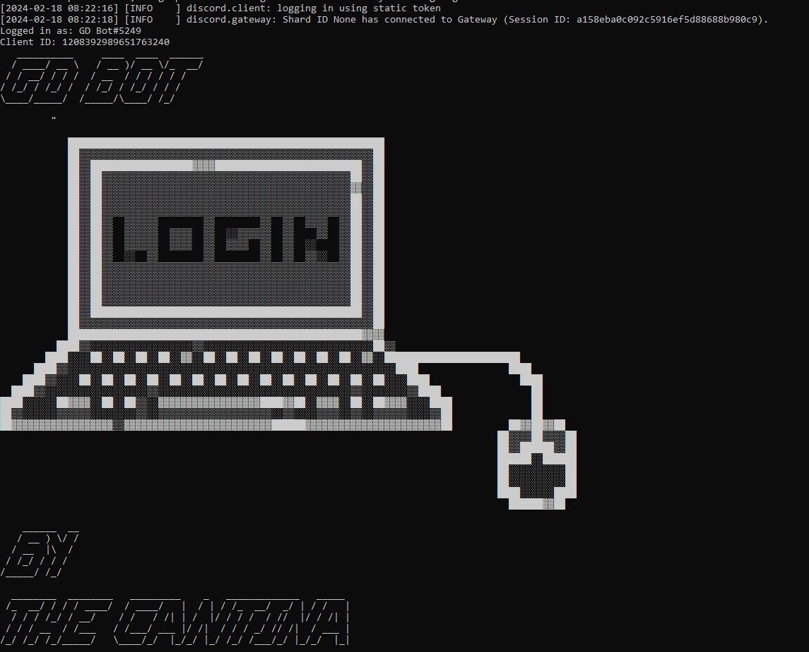
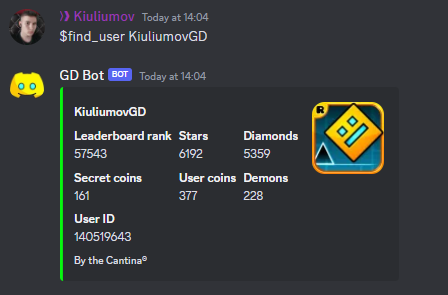
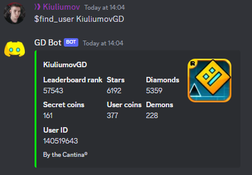

# GD Bot - Geometry Dash Discord Application

## Introduction
GD Bot is a discord application built with the help of the gd.py api wrapper.It is designed to enhance your Geometry Dash experience within Discord by providing various features such as level searching, user accounts, logging into the GD servers, collecting rewards, sending friend requests, and more.It supports slash commands!

## Features
- **Level Searching:** Search for Geometry Dash levels right from Discord.
- **User Accounts:** Manage your Geometry Dash user account directly from Discord.You can send friend requests,load comment,levels and more...
- **GD Server Integration:** Log into the GD servers to access your account and perform actions.
- **Reward Collection:** Collect rewards from completed levels or achievements.

## Installation
1. Clone this repository to your local machine.
2. Install the required dependencies using `pip install -r requirements.txt`.
3. Create a `.env` file in the root directory of the project.
4. Add your Discord bot token and any other necessary environment variables to the `.env` file. Example:
   ```
   TOKEN=your_discord_bot_token
   PREFIX=your_prefix
   APP_ID=your app id
5. Run the bot using `python bot.py`.

## Commands
/daily -> Returns an embed with statistics of the current daily level
/weekly -> Returns an embed with statistics of the current weekly level
/find_user (query: username) -> Returns an embed with account statistics of a given user
/song (query: song_id) -> Returns an embed with the newgrounds page of a song. You also have the option to download the song.
/search (query: level_name) -> Returns an embed that you can update with two buttons (Previous | Next) that allow you to navigate trough all found levels.
## Configuration
The bot is configured using environment variables stored in the `.env` file. Ensure that you have filled out the necessary variables before running the bot.

## Screenshots








## Support
If you encounter any issues or have any questions about the bot, feel free to open an issue on GitHub or contact the developer directly.

## Contributing
Contributions are welcome! If you'd like to contribute to this project, please fork the repository, make your changes, and submit a pull request.

## Disclaimer
This bot is not affiliated with or endorsed by RobTop Games.


